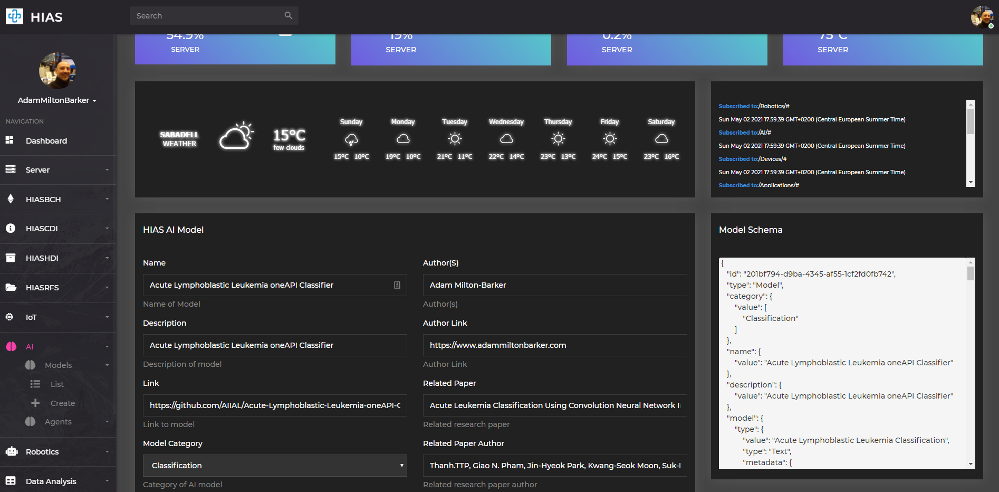
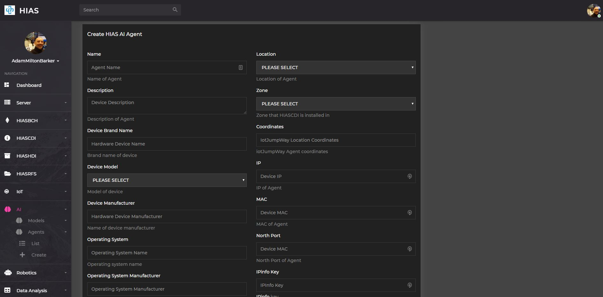
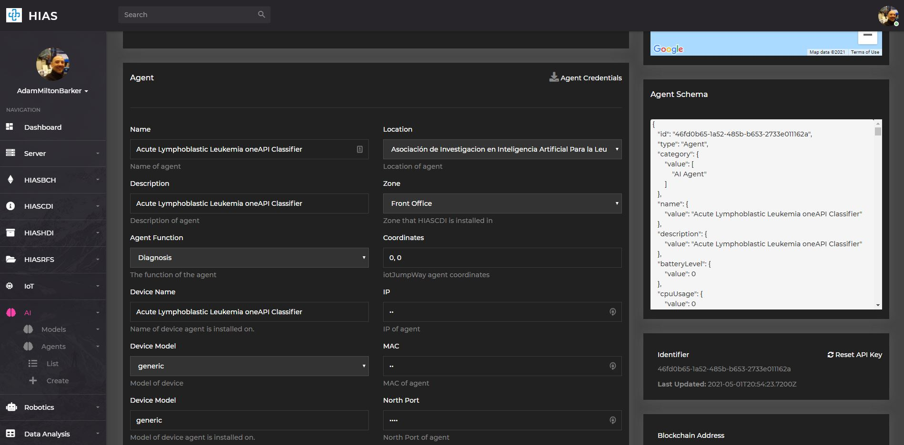

# Peter Moss MedTech Research Project
## GPT-3 Leukemia Information Assistant
### Ubuntu Installation


&nbsp;

# Table Of Contents

- [Introduction](#introduction)
- [Prerequisites](#prerequisites)
	- [Anaconda](#anaconda)
- [Installation](#installation)
	- [Setup File](#setup-file)
- [HIAS](#hias)
	- [AI Model](#ai-model)
	- [AI Agent](#ai-agent)
- [Continue](#continue)
- [Contributing](#contributing)
  - [Contributors](#contributors)
- [Versioning](#versioning)
- [License](#license)
- [Bugs/Issues](#bugs-issues)

# Introduction
This guide will guide you through the installation process for the GPT-3 Leukemia Information Assistant.

# Prerequisites
You will need to ensure you have the following prerequisites installed and setup.

## Anaconda
If you haven't already installed Anaconda you will need to install it now. Follow the [Anaconda installation guide](https://docs.anaconda.com/anaconda/install/ "Anaconda installation guide") to do so.

## HIAS Server
For this project you will need a functioning [HIAS Server](https://github.com/leukaemiamedtech/hias-core). To install the HIAS Server, follow the [HIAS Server Installation Guide](https://github.com/leukaemiamedtech/hias-core/blob/master/docs/installation/ubuntu.md)

# Installation
You are now ready to install the GPT-3 Leukemia Information Assistant software.

## Clone the repository

Clone the [GPT-3 Leukemia Information Assistant](https://github.com/leukaemiamedtech/gpt3-leukemia-information-assistant " GPT-3 Leukemia Information Assistant") repository from the [Peter Moss Acute Myeloid & Lymphoblastic Leukemia AI Research Project](https://github.com/leukaemiamedtech "Peter moss Leukaemia MedTech Research CIC") Github Organization.

To clone the repository and install the OneAPI Acute Lymphoblastic Leukemia Classifier Classifier, make sure you have Git installed. Now navigate to the a directory on your device using commandline, and then use the following command.

```
 git clone https://github.com/leukaemiamedtech/gpt3-leukemia-information-assistant.git
```

Once you have used the command above you will see a directory called **gpt3-leukemia-information-assistant** in your home directory.

```
 ls
```

Using the ls command in your home directory should show you the following.

```
 gpt3-leukemia-information-assistant
```

Navigate to the **gpt3-leukemia-information-assistant** directory, this is your project root directory for this tutorial.

## Developer forks

If you wish to contribute to this project please follow the [AI AGENT CONTRIBUTING](https://github.com/leukaemiamedtech/contributing-guides/blob/main/CONTRIBUTING-GUIDE-AI-AGENTS.md "AI AGENT CONTRIBUTING") guide.

## Setup File

All other software requirements are included in **scripts/install.sh**. You can run this file on your machine from the project root in terminal. Use the commands that follow:

```
 conda activate all-tfmkl
 sh scripts/install.sh
 conda deactivate
```

&nbsp;

# HIAS

This device is a HIAS AI Agent and uses the HIAS MQTT Broker to communicate with the HIAS network. To setup an AI Agent on the HIAS network, head to the HIAS UI.

The HIAS network is powered by a context broker that stores contextual data and exposes the data securely to authenticated HIAS applications and devices.

Each HIAS AI Agent & AI Model has a JSON representation stored in the HIAS Context Broker that holds their contextual information.

## AI Model

A HIAS AI Model is a JSON representation of an Artificial Intelligence model used by the HIAS network.

First you need to set a HIAS AI Model up in the HIAS UI. Navigate to **AI->Models->Create** to create a HIAS AI Model. A future release of HIAS will provide the functionality to import the HIAS JSON representation of the AI Model, but for now you have to manually create the AI Model in the UI.


Once you have completed the form and submitted it, you can find the newly created AI Model by navigating to **AI->Models->List** and clicking on the relevant Model.

On the HIAS AI Model page you will be able to update the contextual data for the model, and also find the JSON representation.



## AI Agent

A HIAS AI Agent is a bridge between HIAS devices and applications, and HIAS IoT Agents. The AI Agents process incoming data by passing it through HIAS AI Models and returning the response back to the requesting device/application.

As with AI Models, AI Agents have an entry in the HIAS Context Broker and a JSON representation stored on the network.

You will now need to create your HIAS AI Agent and retrieve the credentials required by your GPT-3 Leukemia Information Assistant. Navigate to **AI->Agents->Create** to create a HIAS AI Model.



**MAKE SURE YOU SELECT THE PREVIOUSLY CREATED HIAS AI MODEL**

Once you have completed the form and submitted it, you can find the newly created AI Agent by navigating to **AI->Agents->List** and clicking on the relevant Agent.

On the HIAS AI Agent page you will be able to update the contextual data for the agent, and also find the JSON representation.



You now need to download the credentials required to connect the GPT-3 Leukemia Information Assistant to the HIAS network.

Click on the **Agent Credentials** section to download the credentials file. This should open your file browser, navigate to the **GPT-3-Leukemia-Information-Assistant/configuration/** directory and save the file as **credentials.json**.

&nbsp;

# Continue
Now you can continue with the GPT-3 Leukemia Information Assistant [getting started guide](../getting-started.md)

&nbsp;

# Contributing
Peter Moss Leukaemia MedTech Research CIC encourages and welcomes code contributions, bug fixes and enhancements from the Github community.

Please read the [AI AGENT CONTRIBUTING](https://github.com/leukaemiamedtech/contributing-guides/blob/main/CONTRIBUTING-GUIDE-AI-AGENTS.md "AI AGENT CONTRIBUTING") guide for a full guide to contributing to our AI Agent projects. You will also find our code of conduct in the [CODE OF CONDUCT](https://github.com/leukaemiamedtech/contributing-guides/blob/main/CODE-OF-CONDUCT.md) document.

## Contributors
- [Adam Milton-Barker](https://www.leukaemiamedtechresearch.org.uk/about/volunteers/adam-milton-barker "Adam Milton-Barker") - [Peter Moss Leukaemia MedTech Research CIC](https://www.leukaemiamedtechresearch.org.uk "Peter Moss Leukaemia MedTech Research CIC") Founder & Managing Director.

- [Dr Rita Rb-Silva](https://www.leukaemiamedtechresearch.org.uk/about/volunteers/rita-silva-md-phd "Dr Rita Rb-Silva") - [Peter Moss Leukaemia MedTech Research CIC](https://www.leukaemiamedtechresearch.org.uk "Peter Moss Leukaemia MedTech Research CIC") Medical Advisor (Hematology), Porto, Portugal

&nbsp;

# Versioning
We use [SemVer](https://semver.org/) for versioning.

&nbsp;

# License
This project is licensed under the **MIT License** - see the [LICENSE](https://github.com/leukaemiamedtech/hias-all-jetson-nano-classifier/blob/main/LICENSE "LICENSE") file for details.

&nbsp;

# Bugs/Issues
We use the [repo issues](https://github.com/leukaemiamedtech/hias-all-jetson-nano-classifier/issues/new/choose "repo issues") to track bugs and general requests related to using this project. See [AI AGENT CONTRIBUTING](https://github.com/leukaemiamedtech/contributing-guides/blob/main/CONTRIBUTING-GUIDE-AI-AGENTS.md "AI AGENT CONTRIBUTING") guide for more info on how to submit bugs, feature requests and proposals.